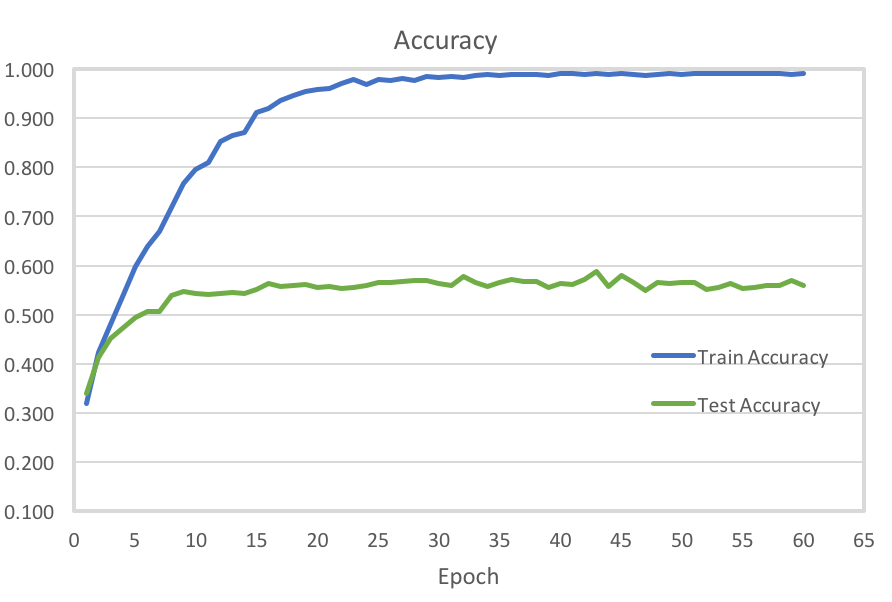
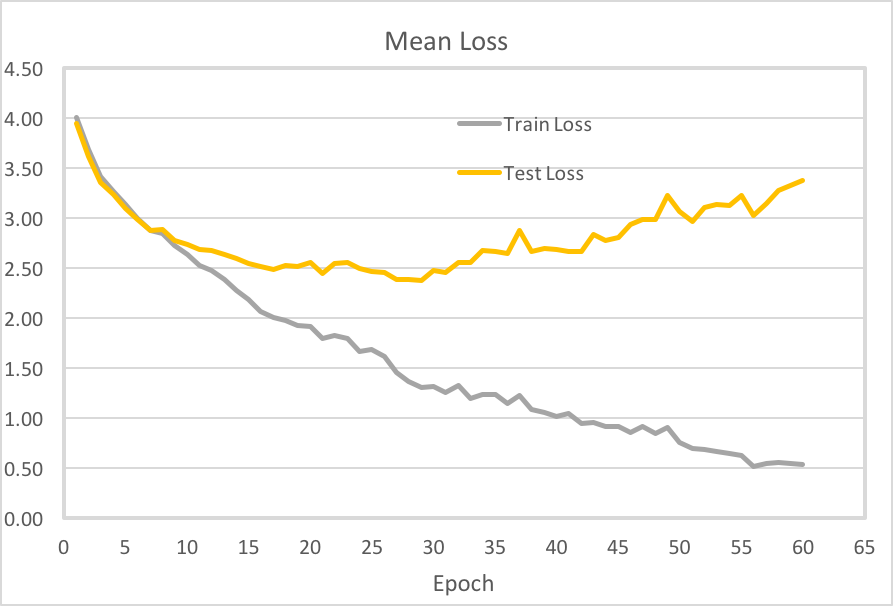
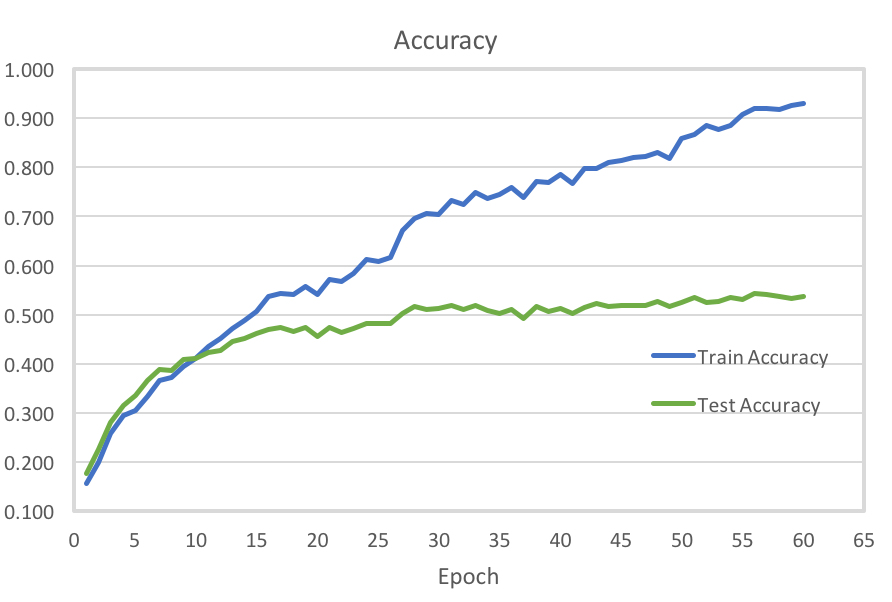

% Machine Learning 2016 Fall
  \break Project 2
% Ming Yao (# 20365468)
% October 17th, 2016

# Introduction

In this project, experimental study on two types of CNN models (LeNet and Network in Network) 
and three real-world data sets (MNIST, CIFAR-10, Caltech 101) is conducted.

Due to several reasons, such as my laptop issues and MATLAB installing issues on server, experiments are implemented based on TensorFlow[^TS]. 
All the experiments are run on a server with the following environment:

* OS: Debian GNU/Linux 8.5 (Jessie)

* CPU: Intel(R) Core(TM) i7-4930K CPU @ 3.40GHz (6 cores, 12 processors)

* GPU: None

For extendability and convenience, I abstract a simple `ConvNet`[^convnet] class that wrap a few TensorFlow operations in modeling a convolution network. 
`ConvNet` offers convenient operations like `add_*_layer` for model definition and computation. 
For detail code please refer to `code/convnet.py`. 

The structure of the project is shown as below:

\dirtree{%
    .1 project2/. 
    .2 code/. 
    .3 caltech101lenet.py. 
    .3 caltech101nin.py.
    .3 cifar10.py.
    .3 convnet.py. 
    .3 mnist.py. 
    .3 run.sh. 
    .3 caltech/. 
    .3 cifar-10/. 
    .3 data/. 
    .3 output/.
}

[^TS]: Detail documentations are at [`http://www.tensorflow.org`](http://www.tensorflow.org)

[^convnet]: The `ConvNet` class is written with reference of the example model TensorFlow offered in [`tensorflow/models/image`](https://github.com/tensorflow/tensorflow/tree/master/tensorflow/models/image).

# LeNet model for MNIST and CIFAR-10

## MNIST

### Model Parameters

[mnistfig]: fig/mnist.png

A LeNet-5 model is trained on MNIST data set. 
The model is defined as [Figure 1][mnistfig], which consists of two convolution layers of filter size $5\times 5$, each proceeding a max-out pooling layer of kernel size $2\times 2$. After the conv-max-conv-max layers, there are two fully connected layers of size 512 and 10 (number of labels). The optimization  objective function is chosen as softmax cross entropy[^softmax]. A momentum algorithm is used to optimize the loss.

[^softmax]: See TensorFlow API definition: http://www.tensorflow.org/versions/r0.11/api_docs/python/nn.html#sparse_softmax_cross_entropy_with_logits

To avoid over fitting, a regularized term with coefficient $0.0005$ is applied. 
Total training epoch is 20, with training batch size of 100. Total training and evaluating time is 2077s.

Detailed model definition and training parameters can be seen at `code/mnist.py`. 

{width=4in}

{width=4in}

### Results

The resulting training accuracy and test accuracy are 99.86% and 99.22% respectively, with training loss of 1.467 and test loss of 1.483.

Loss curves and accuracy curves over time for the training data and test data can be seen at Figure 2 and Figure 3.

We can see that the classification accuracy of both train data and test data grows very quick at the beginning. 
Training accuracy grows gradually until the last epoch, while test accuracy basically becomes stable after the 10th epoch.
Though the test accuracy stops growing, the test loss and train loss keep decreasing until the last epoch. 

## CIFAR-10

### Model Parameters

The LeNet-5 model used to train CIFAR-10 has the same network parameters as in MNIST. See Figure 4. Tht model is trained through 50 epochs, with batch size of 100. Total training and evaluating time is 6847s.

Detailed model definition and training parameters can be seen at `code/cifar10.py`. 

### Results

The resulting training accuracy and test accuracy are 97.48% and 74.49% respectively, with training loss of 0.720 and test loss of 1.763.

Loss curves and accuracy curves over time for the training data and test data can be seen at Figure 5 and Figure 6.

We can see that the training results suffer from over fitting. 
Although train accuracy grows quickly, test accuracy nearly stops increasing after 11th epoch. 
The resulting train accuracy is far higher than test accuracy. 
Moreover, test loss even increase back after 10th epoch.

If we want to get a better result, we should tune a higher regularized term parameter. Due to time limits, here we don't train the model for another time.

{width=4in}

{width=4in}

# Training CNN Models on Caltech 101

## LeNet Model

### Model Parameters

The LeNet-5 model used to train Caltech101 has the same network parameters as in MNIST and CIFAR-10. See Figure 7. The model is trained through 60 epochs, with batch size of 100. The regularized parameter is 1e-3. Total training and evaluating time is 1266s.

Detailed model definition and training parameters can be seen at `code/caltech101lenet.py`. 

### Results

{width=4in}

{width=4in}

The resulting training accuracy and test accuracy are 99.14% and 55.86% respectively, with training loss of 0.800 and test loss of 3.672.

Loss curves and accuracy curves over time for the training data and test data can be seen at Figure 8 and Figure 9.

## Network in Network Model

### Model Parameters

A Network in Network model is also trained for Caltech101 data set. Model parameters can be seen at Figure 10. 
The MLP convolutional (mlpconv) layer is modeled as 1 convolutional layer with 2 consecutive simple convolutional layers which are equivalent as a multilayer perceptron. 
The Global Average Pooling is modeled as a large average pooling layer.
The NIN model consists 3 mlpconv layers. Between each mlpconv layers, a pooling (max or average) layer and 50% dropout is applied. Specific parameters for each layer is defined as in Figure 10.

The optimization objective function is chosen as softmax cross entropy without regularized terms.
An adaptive moment (Adam) algorithm is used to optimize the loss. Total training consists of 60 epochs, with batch size 100 and consumes 10884s.

Detailed model definition and training parameters can be seen at `code/caltech101nin.py`. 

### Results

{width=4in}

{width=4in}

The resulting training accuracy and test accuracy are 92.96% and 53.76% respectively, with training loss of 0.537 and test loss of 3.381.

Loss curves and accuracy curves over time for the training data and test data can be seen at Figure 11 and Figure 12.

# Conclusion

From the above two experiments on LeNet and NIN, we can see that NIN with global average pooling layer has a better performance on preventing over fitting. With more parameters to train, NIN model needs a longer training time.

Compares to LeNet, NIN is a more complicated model and should have a better performance when model parameters are well set. 

However, in this project, NIN has not performed better than LeNet (Better mean loss but worse accuracy).

I also compares my results with Guangneng Hu. Here is the some reasons that I think may lead to such results:

1. Pool parameter settings and unsuitable optimization algorithm. A better learning rate updating scheme may achieve a better results.

2. Pool data preprocessing. I have tried ZCA/PCA whitening for data pre-processing. However, the results does not come out to be good. Due to time limits, I don't have time for further debugging.

3. The training epochs is not large enough. The Caltech 101 models run only 60 epochs. A longer epochs may converge better.

